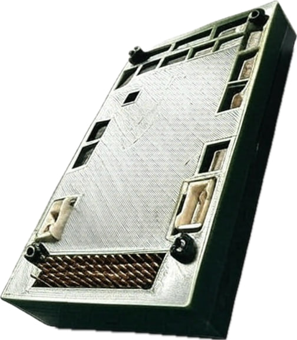
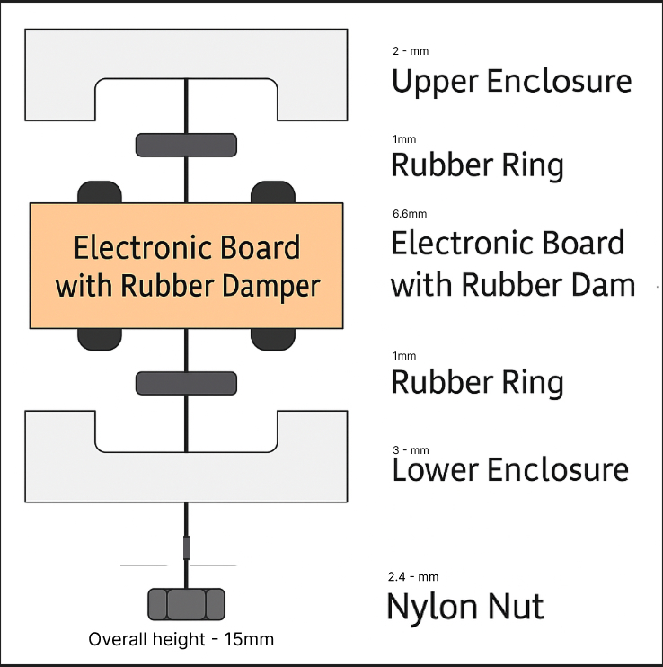

# Комплектація

1× Польотний контролер *Atlas Control*

- у захисному корпусі (98mm х 62mm х 16mm)

- з демпферами

- з лакованою платою

- з SD картою


1× Модуль живлення (до 14S)

2× Кабель живлення

2× JST-GH 1.25мм 6-pin (двосторонні) 

1× JST-GH 1.25мм 3-pin

4× JST-GH 1.25мм 4-pin

2× JST-GH 1.25мм 6-pin

1× JST-GH 1.25мм 7-pin (FTDI-кабель)

1× JST-GH 1.25мм 10-pin

1× Сервокабель

#Розташування в корпусі

