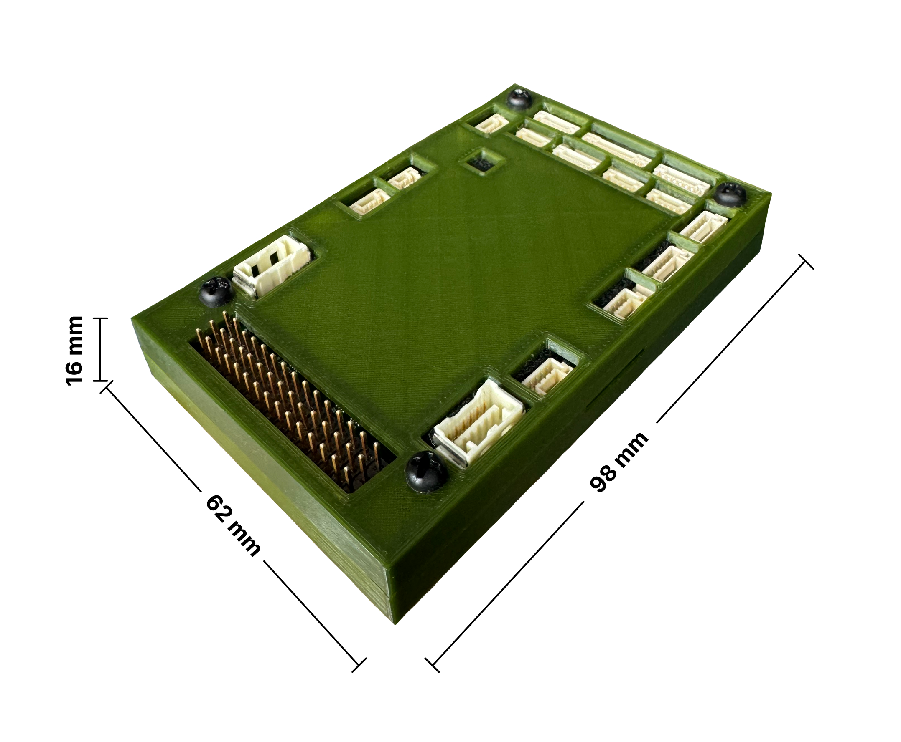

# Atlas Control

Atlas Control — це польотний контролер, розроблений українською командою. Він використовує високопродуктивний процесор STM32H7 та інтегрує сенсори промислового класу. У порівнянні з іншими автопілотами, цей контролер має кращу продуктивність і вищу надійність. Ця плата ідеально працює з прошивкою ArduPilot, а також сумісна з прошивкою PX4. Atlas Control чудово підходить для академічних досліджень і комерційної інтеграції систем.

[Фото плати](images/1.png)

## **Короткий опис**

Основний процесор FMU: STM32H743

### Вбудовані сенсори:
- Акселерометр/Гіроскоп: ICM-42688-P
- Акселерометр/Гіроскоп: ICM-20689
- Акселерометр/Гіроскоп: ICM-20689
- Магнітометр: RM3100
- Барометр: MS5611 ×2

### Інтерфейси:

- 14 PWM-виходів (12 з підтримкою DShot)
- Підтримка кількох типів RC-входів (SBUS/CPPM/DSM)
- Аналоговий/PWM вхід RSSI
- 2 GPS-порти (GPS та UART4)
- 6 шин I2C (чотири з них — спеціалізовані порти I2C)
- 2 порти CAN-шини
- 2 порти живлення (Power A — стандартний ADC-інтерфейс, Power C — інтерфейс живлення UAVCAN)
- 1 вхід ADC
- 1 USB-порт

### Система живлення:
- Головне Живлення: 4.5 ~ 5.4 В
- Вхід USB: 4.75 ~ 5.25 В
- Вхід сервоприводів: 0 ~ 10 В

### Вага та розміри:
- Розміри: 98мм х 62мм х 16мм
- Вага: 58г

## *Інші характеристики:*
- Внутрішнє амортизування
- Підтримка підігріву IMU для покращення роботи сенсорів
- Окремий порт живлення UAVCAN
- Робоча температура: -20 ~ 85°C

!!! Warning
- Порт RCIN призначений лише для живлення RC-приймача і не може використовуватись для підключення живлення чи навантаження.

###Номінали напруги
Автопілот Atlas Control підтримує потрійну резервовану систему живлення, якщо підключено три джерела живлення. Три силові шини: POWER_A, POWER_C і USB.

!!! Warning
Живлення шини PWM OUT

- Силові шини PWM OUT (0В до 10В) електрично **з'єднані** з лініями живлення VCC 5V/BATT_ADC.
У такій конфігурації можливе ненавмисне живлення шини PWM через PMU, що може спричинити збої в роботі автопілота (наприклад, втрату зв’язку або імпульсів до ESC/серво).

!!! tip
✅ Рекомендовано: для живлення потужних сервоприводів або ESC використовуйте зовнішній BEC, підключений безпосередньо до PWM-шини, щоб уникнути перевантаження або нестабільної роботи системи.

!!! Note
У настпуних версіях Atlas Control буде використовуватись подібна імплементація:

 - Силові шини PWM OUT (0В до 10В) не живлять плату автопілота і не отримують живлення від неї. Щоб автопілот працював, необхідно подати живлення на одну з ліній: POWER_A, POWER_C або USB. Без цього плата залишиться знеживленою.

###Максимальні параметри для нормальної роботи:
У звичайному режимі роботи автопілот Atlas Control використовує джерела живлення у такому порядку пріоритету:

1. POWER_A та POWER_C (вхідна напруга: 4.5 В до 5.4 В)

2. USB-вхід (вхідна напруга: 4.75 В до 5.25 В)

Тобто, система завжди надає перевагу живленню через POWER_A/POWER_C, а USB використовується лише у разі їхньої відсутності.

###Порт налагодження (Debug Port)
Системна серійна консоль та інтерфейс SWD працюють через порт DSU7.
Для підключення достатньо з’єднати FTDI-кабель з роз’ємом DSU7 (у комплекті продукту є кабель від виробників).

###Периферійні пристрої, що підтримуються:
- Цифровий датчик повітряної швидкості
- Телекомунікаційний радіомодуль
- Дальноміри / Датчики відстані
- Інші сумісні пристрої

